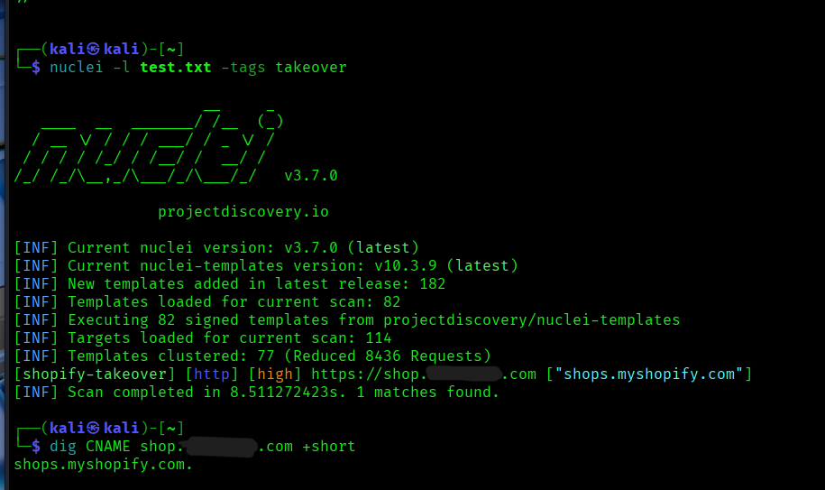
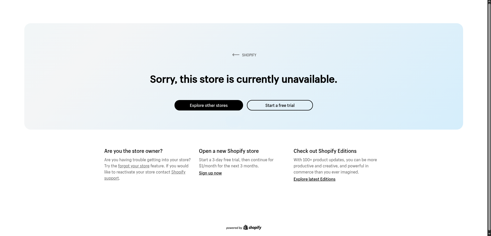

# Dangling DNS Record & Subdomain Takeover Analysis (Shopify Edge Mitigation)

## Overview
During an external asset discovery and reconnaissance assessment on `target.com`, an orphaned (dangling) **CNAME** record was identified pointing to Shopify's edge infrastructure (`shops.myshopify.com`).

While Shopify's platform-level safeguards (mandatory DNS TXT verification) successfully mitigate an immediate full takeover, the presence of an orphaned record represents an active **DNS Misconfiguration** and poor DNS hygiene that unnecessarily widens the attack surface.

---

## Vulnerability Details
* **Vulnerability Type:** DNS Misconfiguration / Dangling CNAME
* **Severity:** Medium
* **Affected Asset:** `shop.target.com`
* **DNS Provider:** AWS Route 53
* **Target Pointer:** `shops.myshopify.com`

---

## Technical Description
When an organization decommissions a third-party service (such as an external Shopify store) without removing the corresponding DNS records in their hosted zone, the domain remains in a dangling state.

Historically, an unassigned CNAME pointing to `shops.myshopify.com` allowed an attacker to claim the subdomain instantly by adding it to their own Shopify tenant. Today, Shopify enforces a domain verification mechanism requiring a unique TXT record before routing traffic.

However, leaving dangling DNS records active introduces several security and operational risks:
1. **Third-Party Policy Drift:** Relying on vendor-side mitigations creates external dependency; any architectural change or edge case in the provider's validation workflow can expose the domain.
2. **Social Engineering / Support Escalation:** Attackers could leverage residual records to mislead third-party support teams into manually overriding verification.
3. **Reputational Impact:** The public-facing subdomain actively serves broken provider error states, signaling abandoned or unmonitored infrastructure.

---

## Proof of Concept (PoC)

### 1. Automated Detection & DNS Enumeration
Reconnaissance was conducted using ProjectDiscovery's Nuclei to detect unmapped third-party services:

<pre><code>$ nuclei -l targets.txt -tags takeover
[shopify-takeover] [http] [high] https://shop.target.com ["shops.myshopify.com"]</code></pre>

Querying the authoritative CNAME record confirmed that the routing remains active:

<pre><code>$ dig CNAME shop.target.com +short
shops.myshopify.com.</code></pre>

---

### 2. Browser Verification
Navigating to `[https://shop.target.com](https://shop.target.com)` in a browser triggered Shopify's generic unlinked tenant page:
> *"Sorry, this store is currently unavailable."*

---

### 3. Takeover Attempt & Safeguard Analysis
To verify whether a full takeover was achievable, an attempt was made to link `shop.target.com` to an external test store in the Shopify Admin Console.

Shopify blocked immediate attachment, enforcing the creation of a domain ownership verification record:
* **Record Type:** `TXT`
* **Host Name:** `shopify_verification_shop`
* **Expected Value:** `<Unique-Verification-Token>`

Because the TXT record must be published inside the authoritative DNS zone of `target.com`, external claiming is halted at the vendor layer, confirming the vulnerability is scoped to a **Dangling DNS Misconfiguration**.

---

## Remediation
To eliminate the dangling record and restore proper DNS hygiene:
1. Access the authoritative DNS management console (e.g., **AWS Route 53**).
2. Locate the hosted zone for `target.com`.
3. Delete the orphaned `CNAME` record for `shop.target.com` pointing to `shops.myshopify.com`.

---

## Key Takeaways
* Automated scanner findings (e.g., Nuclei high severity tags) should always be verified manually against third-party platform mitigations.
* Defensive controls hosted by third-party SaaS vendors do not replace internal DNS hygiene; decommissioning applications must always include purging corresponding DNS entries.
